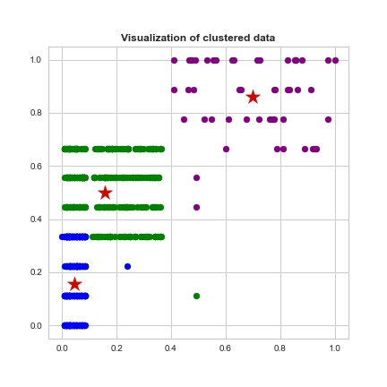
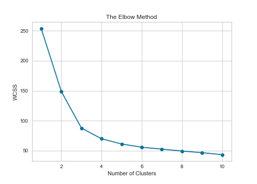
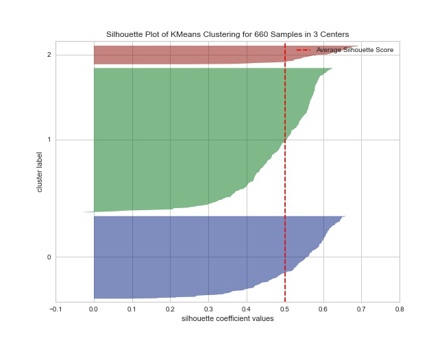
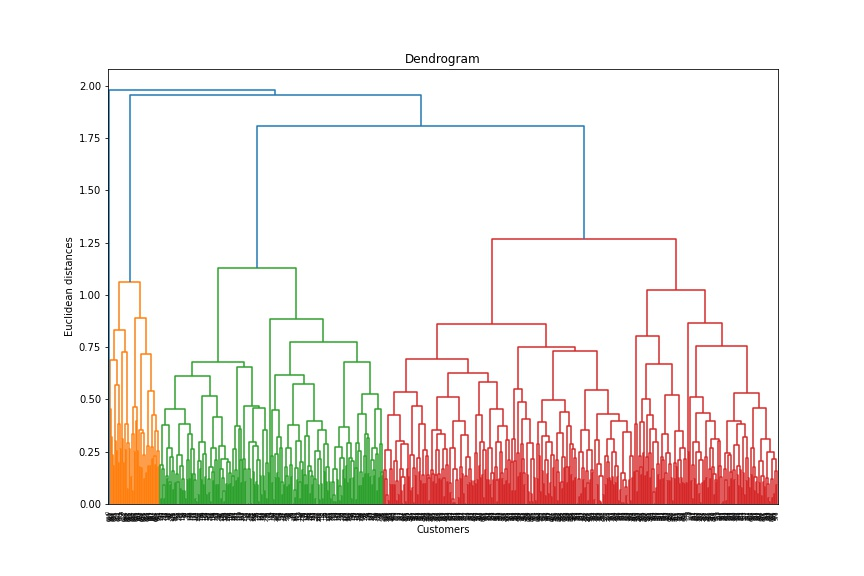
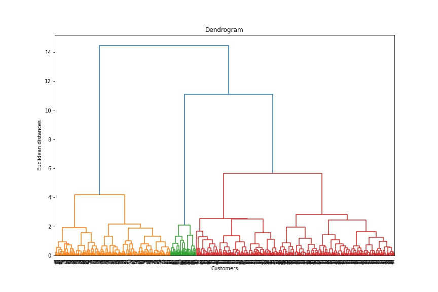

# Credit Card Customer Analysis Project 

  

 ### Project Overview:
 
This project consisted of evaluating characteristics of credit card customers. The given data consisted of features such as average credit limit, total credit cards, visits to the bank and online, and calls made to the bank. Since we would like to evaluate characteristics of customers and there is no target variable, we need to use unsupervised learning techniques to gather information from the data. 

In particular, evaluating the characteristics of the clusters consisted of implementing the well known clustering methods KMeans and Hierarchical. Using elbow plots, silhouette graphs, and dendrograms, it was found that three clusters was the optimal number of clusters for this data. To understand and evaluate the clusters various exploratory data analysis techniques were used including box plots, violin plots, and distributions. The Hierarchical clustering technique retured the highest silhouette score of the two methods and it would appear that this technique is best for the data. 

Here is a detailed customer cluster analysis from the Hierarchical technique: 

- __Cluster 0:__ This cluster is in between the next two clusters on average. The credit limits seem to indicate that these are middle class customers that have a good amount of interactions with the bank. This would indicate that these are responsible customers from a business standpoint. Depending on the length of their time with the bank, it could be worthwhile to extend their potential lines of credit to hopefully increase their credit spending activity, resulting in more business revenue for the bank. 

- __Cluster 1:__ Given the high credit limits of these customers along with the most interactions, it would suggest that these customers are high quality customers. This may indicate that not only do these customers have a higher average income but are also more responsible. This would suggest that these customers can be very profitable from an advertisement standpoint.

- __Cluster 2:__ Since this cluster has the most customers within it, many of the metrics are highest here. Given that these customers tend to have lower average credit limits as well as lower number of credit cards, this may signal that they have a lower income or have developing credit. It may be worthwhile business wise to interact with these customers to potentially reduce churn and potential credit default. This can be done via check in emails, calls, amd account reminders when visiting online. 

## Code and Resources Used 
**Python Version:** 3.9  
**Packages:** pandas, numpy, sklearn, matplotlib, seaborn

**Books Used**: 
- Grus, Joel. Data science from scratch: first principles with python. O'Reilly Media, 2019.
- Bruce, Peter, Andrew Bruce, and Peter Gedeck. Practical Statistics for Data Scientists: 50+ Essential Concepts Using R and Python. O'Reilly Media, 2020.
- McKinney, Wes. Python for data analysis: Data wrangling with Pandas, NumPy, and IPython. " O'Reilly Media, Inc.", 2012.

**URLs Used**: 
- https://towardsdatascience.com/understanding-the-concept-of-hierarchical-clustering-technique-c6e8243758ec
- https://towardsdatascience.com/a-deep-dive-into-k-means-f9a1ef2490f8

## Data Cleaning: 
The data itself was very clean as given with no missing values. The only cleaning that was done was to engineer features that I thought would be important for the clustering process. The features that were created were 'interactions', 'avg_credit_per_card', and 'avg_credit_per_interactions'. 

## EDA
The following images are highlights of the exploratory data analysis performed on this data set. A quick summary of each image is given. 

### KMeans Clustering
* Scatter plot giving the potential clusters along with their centroids.  

* This elbow plot shows that the ideal number of clusters could potentially be three for KMeans clustering. 

* The following silhouette plot shows the average silhouette score for the data as well as how large each cluster is relative to the other clusters. Further analysis was done on other cluster sizes and this graph gave the best silhouette score. 

### Hierarchical Clustering
* Dendrogram for the hierarchical clustering technique. This dendrogram was graphed using the 'Max' metric. The graph shows that three clusters could be optimal but the branches also have a long length, indicating large dissimilarity between the clusters. 

* Dendrogram for the hierarchical clustering technique. This dendrogram was graphed using the 'Ward' metric. The graph shows that again three clusters and the branches are relatively long indicating nice cluster dissimilarity. We will use this metric in the agglomerative clustering method as well as three clusters. 

## Model Building: 

For this problem, we used two different clustering techniques: KMeans and Agglomerative Hierarchical Clustering. Analysis was done to find the best number of clusters for each technique. Various metrics were used for the hierarchical technique including: 'Complete (Max)', 'Weighted', 'Average', and 'Ward'. 

## Models Used: 
*	**KMeans Clustering** – Interpretable model and a baseline for seeing what could occur with clustering. 
*	**Hierarchical Clustering** – Given the amount of data, the Hierarchical technique was used for further analysis to contrast against KMeans. 

## Model performance

* KMeans Clustering: 
  * Silhouette score with three clusters: 0.1541

* Hierarchical Clustering: 
  *  * Silhouette score with three clusters: 0.1796

